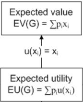

<link rel="stylesheet" type="text/css" href="include/style.css">

<!-- From https://stackoverflow.com/a/37839683/1297830 -->
<link rel="stylesheet" type="text/css" href="include/hideOutput.css">
<script src="include/hideOutput.js"></script>

By Jonas Kristoffer Lindeløv ([blog](https://lindeloev.net), [profile](https://vbn.aau.dk/da/persons/117060)).<br />
Last updated: `r format(Sys.time(), '%d %B, %Y')` (See [changelog](https://github.com/lindeloev/utility-theory/commits/master)).


<!-- Social sharing. From simplesharebuttons.com -->
<style type="text/css">
  #share-buttons img {
    width: 40px;
    padding-right: 15px;
    border: 0;
    box-shadow: 0;
    display: inline;
    vertical-align: top;
  }
</style>

<div id="share-buttons">
<!-- Twitter --><script async src="https://platform.twitter.com/widgets.js" charset="utf-8"></script><a href="https://twitter.com/intent/tweet?text=Utility%20Theory%20For%20Dummies%20https%3A%2F%2Flindeloev.github.io%2Futility-theory%20via%20%40jonaslindeloev" class="twitter-hashtag-button" data-size="large" data-related="jonaslindeloev" data-show-count="false">Share on Twitter</a> &nbsp;&nbsp;&nbsp;<!-- Facebook --><a href="http://www.facebook.com/sharer.php?u=https://lindeloev.github.io/utility-theory/" target="_blank"></a><!-- LinkedIn --><a href="http://www.linkedin.com/shareArticle?mini=true&amp;url=https://lindeloev.github.io/utility-theory/" target="_blank"></a><!-- Digg --><a href="http://www.digg.com/submit?url=https://lindeloev.github.io/utility-theory/" target="_blank"></a><!-- Reddit --><a href="http://reddit.com/submit?url=https://lindeloev.github.io/utility-theory/&amp;title=Utility Theory for Dummies" target="_blank"></a><!-- Email --><a href="mailto:?Subject=Common statistical tests are linear models (or: how to teach stats)&amp;Body=https://lindeloev.github.io/utility-theory/"></a>
</div>


<br />

```{r echo=FALSE}
# Options for building this document
knitr::opts_chunk$set(
  fig.height=4, 
  fig.width=6, 
  fig.align='center',
  message=FALSE,
  warning=FALSE
)

#devtools::install_github("jumpingrivers/headR")
headR::add_twitter_card(
  card_type = "summary_large_image",
  title = "Utility Theory for Dummies",
  user = "@jonaslindeloev",
  image = "https://lindeloev.github.io/utility-theory/utility_ptsd.png",
  file = "include/twitter_card.html"
)

# To show tables.
print_df = function(D, decimals=4, navigate=FALSE) {
  DT::datatable(mutate_if(D, is.numeric, round, decimals), 
    rownames = FALSE,
    options = list(
      searching=FALSE, 
      lengthChange=FALSE, 
      ordering=FALSE, 
      autoWidth=TRUE, 
      bPaginate=navigate, 
      bInfo=navigate, 
      paging=navigate
    )
  )
}
```

How do you use data to make optimal decisions? A popular answer is [utility theory](https://saylordotorg.github.io/text_risk-management-for-enterprises-and-individuals/s07-01-utility-theory.html) and the aim of the present tutorial is to show that it can be dead-easy!

Here's a sneak peek at the full code for the first example we'll go through. Three simple steps in six lines of code, and you have an optimal decision:

```{r, eval=FALSE}
# Step 1: infer predictors (classical regression)
fit_gut = brm(previous_earnings ~ gut_feeling, D)

# Step 2: cost function on predictions from fit
predicted_utility = function(gut_feeling) {
  earn_pred = predict(fit_gut, data.frame(gut_feeling=gut_feeling))
  utils_pred = ifelse(earn_pred < 1500, yes = earn_pred, no = earn_pred*0.9)
  utils_pred
}

# Step 3: choose the gut_feeling which maximizes Expected Utility
optim(1000, function(x) -mean(predicted_utility(x)))
```


The exact model and layout will vary from problem to problem, but the general three-step approach stays the same. It scales all the way to Generalized Linear Mixed Models (GLMM) and beyond. I start by presenting a [minimal example on tax evasion](#ex1_tax), followed by a slightly more extended example on choosing the [optimal treatment plan for a particular PTSD patient](#ex2_ptsd).

The theory is quite simple: to get from classical stats to Utility Theory, just assign *utilities* to the values ($u(x_i)$) instead of reporting them verbatim ($x_i$). That happened in the `ifelse` line above.

<center>

</center>

<br />

To set up the required packages, see the [Getting Started](#setup) section. If you feel like it, I've written a [very simple middle-school-level mathematical intro to these concepts](#theory). See also other excellent tutorials [here](http://www.statsathome.com/2017/10/12/bayesian-decision-theory-made-ridiculously-simple/) and [here](https://nbviewer.jupyter.org/github/CamDavidsonPilon/Probabilistic-Programming-and-Bayesian-Methods-for-Hackers/blob/master/Chapter5_LossFunctions/Ch5_LossFunctions_PyMC2.ipynb). This can be extended to *Prospect Theory* and many others decision making frameworks (see a great overview in [the vignette to the `pt` package](https://mran.microsoft.com/snapshot/2014-09-08_1746/web/packages/pt/vignettes/pt_vignette.pdf)).


Setup:
<div class='fold s'>
```{r message=FALSE, warning=FALSE, paged.print=TRUE, results='hide'}
set.seed(42)

library(brms)
library(tidyverse)
library(openxlsx)
```
</div>


# Simple example: Evading taxes! {#ex1_tax}
The tax year is almost over and a new customer asks if you can do a quick job before the end of the year. Your gut feeling is that this is a $1,100 job, but you're unsure how accurate this is. You have recorded your initial gut feelings and the actual corresponding earnings for other jobs this year (see below). The thing is, you've already earned $18,500 this year and if you earn more than $20,000 you have to pay a 10% tax on *all of* your income. I.e., there's a large *cost* or *negative utility* of at least $2.000 if this job turns out to yield above $1,500.


```{r}
D = data.frame(
  previous_earnings = c(2000, 4000, 800, 4000, 700, 400, 3100, 1800, 1700), 
  gut_feeling = c(1600, 3700, 600, 3600, 600, 300, 3300, 1600, 1400))
```
```{r, echo=FALSE}
print_df(D)
```


We will solve this problem using the magical three steps:

1. Infer how `gut_feeling` predicts `earnings`.
2. Predict `earnings` when `gut_feeling = 1100`  and apply a utility function to it (taxes).
3. Decide whether to take the job.


## Step 1: Infer predictors
Let's do a simple linear regression to model how that gut feeling *predicts* actual earnings. For now, we use default priors for simplicity.
```{r order_brm, cache=TRUE, results='hide', message=FALSE, warning=FALSE}
fit_gut = brm(previous_earnings ~ gut_feeling, D)
```


## Step 2: Add the utility of taking the job
We used Bayesian `brms::brm` above because it has an associated `predict` function, which gives us the earnings and the associated probability for each hypothetical earning given `gut_feeling = 1000`. This is called the *posterior predictive distribution*. You just can't get that from the frequentistic counterparts.

```{r}
values = predict(fit_gut, data.frame(gut_feeling=1100), summary=FALSE)
```

`values` is visualized in the blue histogram below. 

Now you can calculate the *utility* of taking this job. Remember, when `values < 1500`, the utility of each dollar is just one dollar (`1.0 * values`). However, when `values > 1500` the utility is `values * 0.9`. In addition, there's a one-time large *negative utility* of the tax on all your previous earnings (`18500 * 0.1`). That is our *utility function* for each of the hypothetical earnings.
```{r}
utilities = ifelse(values < 1500, values, values * 0.9 - 18500 * 0.1)
```

We can visualize `utilities` vs. `values`. See how the above-tax-threshold earnings are shifted to the left:

<div class='fold s'>
```{r, fig.height=2.5, fig.width=8}
# Put it in a data.frame
D_plot = data.frame(values, utilities)

# Plot it
ggplot(D_plot) +
  # Histograms of posterior predictive and 
  geom_histogram(aes(x=utilities), bins=100, fill='darkred') + 
  geom_histogram(aes(x=values), bins=100, col='blue', alpha=0.3) +
  
  # Lines for expected value and expected utility
  geom_vline(aes(xintercept=mean(utilities), color='Expected Utility'), lwd=3, show.legend=TRUE) + 
  geom_vline(aes(xintercept=mean(values), color='Expected Value'), lwd=3) + 
  geom_vline(aes(xintercept=1100, color='Gut Feeling'), lwd=3) +
  
  # Styling
  labs(x = 'Earnings (value)', y='', title='Expected value and utility for gut_feeling = $1,100') +
  scale_x_continuous(breaks=seq(-5000, 5000, 500)) + 
  theme_bw(13) + 
  theme(axis.ticks.y = element_blank(), axis.title.y = element_blank(), axis.text.y = element_blank()) + 
  
  # Legend
  #scale_colour_manual(name="Means",values=c('Expected Value'='blue', 'Expected Utility' = 'red', 'Gut Feeling'='green'))
  scale_color_manual(name = "", values = c('Expected Value'='blue', 'Expected Utility' = 'red', 'Gut Feeling'='green'))
```
</div>

## Step 3: decide whether to take the job
To summarise, if you take the job:

* Your gut feeling told you that you would earn $1.100 from this job
* Your gut feeling is an underestimate. `predict(fit, data.frame(gut_feeling=1100)` show that you should expect on average $1,285.
* When factoring in the risk of crossing the tax threshold and the associated costs (loss), you can expect on average around $896.

Now you have the raw numbers on the table. You decide whether to take the job.


## Step 3 extended: choose one of several jobs
A more common situation in decision making is this: you have multiple jobs available, each with it's own `gut_feeling`. As a rational decision maker, you should pick the one which gives you the most profit (we sidestep the issue of the amount of work needed to do each job, but that's easy to implement as we shall see in the next examples). 

We wrap step 2 above (prediction + utility function) in a function called `predicted_utility` and run it for a range of gut_feelings:
```{r}
predicted_utility = function(gut_feeling) {
  # Posterior predictive samples (values)
  values = predict(fit_gut, data.frame(gut_feeling=gut_feeling), summary=FALSE)
  
  # Associated utilities. Posterior predictive utilities?
  utilities = ifelse(values < 1500, values, values * 0.9 - 18500 * 0.1)  # 
  utilities  # Return it
}
```


To make an informed decision, you would probably start by plotting `predicted_utility` for the available jobs or for a range of `gut_feelings` and eye-ball which you are willing to go with. You can see that around $1000 is a local sweet spot and that `gut_feeling = 1100` is still relatively OK:

```{r predict_gut, cache=TRUE}
# Evaluate this for gut feelings 0, 100, 200, 300, etc.
D_plot = data.frame(gut_feelings = seq(0, 4000, 100)) %>%
  rowwise() %>%
  mutate(utilities = map(gut_feelings, predicted_utility)) %>%  # Nested list
  unnest()  # To long format

# Visualize a fraction of it to speed up.
ggplot(sample_frac(D_plot, 0.1), aes(x=gut_feelings, y=utilities)) + 
  geom_jitter(width=50, height=0, alpha=0.1) +  # Utility-transformed posterior predictive samples
  stat_summary(geom='line', lwd=3, col='red') +   # Expected utility
  geom_vline(xintercept=1100, col='green', lwd=2)  # Gut feeling (see previous figure)
```


You can see that you should definitely not take the job if your gut feeling is a profit in the range between $1.200 and $3.500 where you would basically work for free. For larger jobs (e.g., $10.000), you would still profit substantially.


If you want to search for local maxima or minima, you can leverage `optim` to find it. Give it a reasonable starting value and put a minus sign on the mean of `predicted_utility` to find a local maximum. Here `$par` is the `gut_feeling` and `$value` is the expexted earnings (`mean(utilities)`).

```{r optim_gut, cache=TRUE}
optim(1000, function(x) -mean(predicted_utility(x)))
```


# Extending it: choosing optimal therapy type and length {#ex2_ptsd}
This example will stick to the same three-point recipe but extend it to show the versatility of this approach.

As a specific example, say you have to decide on a treatment plan for patients suffering from PTSD. PTSD is an anxiety disorder where patients have excessive fear responses to some particular "stressors", e.g., social gatherings. **Exposure therapy** is the method exposing patients to "safe" (and gradually increasing) levels of these stressors, thus de-traumatizing them. You can do exposure therapy in real life (IRL) or in virtual reality environments (VR).

You have kept track of the outcomes of earlier treatments using an Excel sheet ([Download ptsd_data.xlsx](ptsd_data.xlsx)):
```{r}
D = readxl::read_xlsx('ptsd_data.xlsx')
```

```{r, echo=FALSE}
print_df(D, navigate = TRUE)
```

It is coded like this:
* `success == 0` is a treatment failure.
* `symptoms` is the number of symptoms fulfilled at baseline (0 to 5 according to DSM). The more, the worse the patient is off.
* `method == 'vr'` is virtual reality-based exposure.
* `sessions` is the number of sessions used to obtain the success/failure (`success`).


## Step 1: Infer predictors
Here, we find out how therapy characteristics predict `success`. Since `success` is binary, we will use a logistic model (see `family=bernoulli` below). This may be the first time in the world someone runs this exact model and it has no name. But as long as it can generate a *posterior predictive distribution*, calculating and optimizing utility is possible.

```{r}
model_ptsd = success ~ sessions + sessions:method + mo(symptoms)
```

I made this model to make sure that your intuition would fail you! That's when we need statistical inference as a decision support. Briefly:

 * `sessions`: how much each session increases the chance of success (a slope). This will be represent `method == 'IRL'`. We know a priori that this effect is positive in general so below we put a `normal(mean=1, sd=1)` prior on this slope. Remember that the unit is *logits* which is not easily interpreted in isolation. We could have used a `lognormal()` prior or set a lower bound at zero (`lb = 0`) to constrain it to positive values.
 * `sessions:method`: how much each session of `method == 'VR'` increases the chance of success over and beyond `method == 'IRL'`. We know a priori that VR exposure is slightly more effective than IRL exposure (see e.g. [Opris et al., 2012](http://www.web.teaediciones.com/Ejemplos/PSIOUS_Opris%20i%20cols%20(2012)%20VRET%20in%20anxiety%20disorders.%20A%20Quantitative%20Meta-analysis.pdf) or [this](https://www.sciencedirect.com/science/article/pii/S0272735815000987#bb0295) or [this](https://onlinelibrary.wiley.com/doi/abs/10.1002/da.20910)) so we put a `normal(1, 1)` prior on this term.
 * `mo(symptoms)`: More symptoms likely reduce the chance of success, everything else being equal. This effect is modeled as ordinal (monotonic, `mo`).


To put priors on the predictors, let's first look up their names:
```{r}
get_prior(model_ptsd, D, family=bernoulli)
```

Now we set the priors (see [a helper function here](#citosd), though I used a more informal approach here):
```{r}
priors = c(
  # Positive treatment effect of IRL
  set_prior('normal(1, 1)', coef='sessions'),
  
  # On top of IRL, add an even better expected treatment effect of VR
  set_prior('normal(1, 1)', coef='sessions:methodVR')
)
```

Run the inference on the `model` and `priors` and check the fits and convergence:
```{r ptsd_brm, cache=TRUE, results='hide', message=FALSE, warning=FALSE}
fit_ptsd = brm(model_ptsd, prior=priors, data=D, family=bernoulli)

# fit_ptsd  # summary; check that rhat ~ 1
# pp_check(fit_ptsd)  # Posterior predictive checks
plot(fit_ptsd)  # Good mixing in traceplots and reasonable posteriors?
```

The fits look reasonable and the mixing is good. As you can see, our data `D` overcomes the (relatively vague) VR-positive prior so that the posterior has slightly more mass on negative values of VR compared to IRL (`b_sessions:methodVR`).


## Step 2: Define a utility function.
We have three predictors. Let us try to make a prediction for a patient with three symptoms and 8 sessions of virtual Reality-based exposure:
```{r}
new_patient = data.frame(symptoms=5, method='VR', sessions=10)  # Hypothetical patient
predict(fit_ptsd, newdata=new_patient)  # Predict treatment success
```

Around 55% chance of success.

Now, let's define some utilities. There is a negative utility (cost) of therapist fees and in the opportunity cost of treatment failures. There is a positive utility of treatment success. We want to engage in therapy if the latter to overcomes the former, and to avoid it if it doesn't.


I propose the following costs (in USD):
```{r}
value_session = list(VR=-100, IRL=-150)  # Negative (cost)
value_outcome = c(success=3000, failure=-1000)  # Positive and negative
```


Let's define a function which returns the utility associated with a set of predictors:
```{r}
predicted_utility = function(sessions, method, symptoms) {
  # Make the prediction
  new = data.frame(sessions, method, symptoms)
  prob_success = predict(fit_ptsd, newdata=new)[1]  # Just get the success rate
  
  # (Negative) utility of treatment (cost)
  value_therapy = value_session[[method]] * sessions  # cost times sessions
  
  # Utilities of outcomes (cost and gain)
  value_success = prob_success * value_outcome['success']
  value_failure = (1-prob_success) * value_outcome['failure']
  
  # Return utility. Some of these are negative.
  value_success + value_failure + value_therapy
}
```


<font color='gray'>
(ASIDE: Many would object that we are comparing apples and oranges here: The therapy cost is monetary and the human value of a treatment success/failure is "soft". However, for utility theory to work, we need to but everything on the same scale to compare them. This is often called $utils$ and [is a big topic in and of itself](https://en.wikipedia.org/wiki/Utility#Functions) in philosophy. However, it is the foundation of much policy in practice around the world. Just look up [value of statistical life](https://en.wikipedia.org/wiki/Value_of_life). Although policy literally puts monetary values on people's lives, $utils$ should just be though of as relative utilities. Eight utils are double as much as four utils (or at least higher). Whether each util correspond to $10, $56 or the joy of eating an ice cream is arbitrary, as long as the proportions stay the same.)
</font>


## Step 3: Make a decision

Visualize the utilities associated with all treatment options (`method` and `sessions`) for two patients. One patient with 3 symptoms (solid) and one with 5 symptoms (dashed):
<div class='fold s'>
```{r predict_ptsd, cache=TRUE, fig.width=9, fig.height=4}
# Make data frame with all combinations of predictors
D_plot = crossing(
    sessions = 1:21,  # From 1 to 18 treatment sessions
    method = c('VR', 'IRL'),
    symptoms = c(3, 5)
  ) %>%
  
  # Now add the associated utility for each combination
  rowwise() %>%
  mutate(utility = predicted_utility(sessions, method, symptoms))

# Plot it
utility_curves = ggplot(mutate(D_plot, symptoms=as.character(symptoms)),  # make symptoms non-numeric
       aes(x = sessions, y=utility, color=method, lty=symptoms)) + 
  geom_line(lwd=2) + 
  labs(y = 'Utility (in USD)', title='Utilities for two patients') +

  # Unneccessary stuff to make it look nicer
  scale_x_continuous(breaks=1:30) +
  scale_y_continuous(breaks = seq(-3000, 3000, by=500)) +
  geom_hline(yintercept=0) +
  theme_gray(15) + 
  theme(panel.grid.minor.x = element_blank())

utility_curves
```
</div>


```{r, echo=FALSE}
# For Twitter card
ggsave('utility_ptsd.png', utility_curves, width=8, height=3.5)
```


For a three-symptoms patient, you would probably plan for 11 sessions of VR exposure, everything else being equal. For a five-symptom patient, you would plan for 14 sessions of VR exposure. You would definitely avoid combinations where there is a net negative utility (curve is below zero).

Note that even though IRL exposure is probably more effective (see parameter estimates in `fit`), this is not outweighted by the increased cost per session! This is particularly evident after 10+ sessions where squeezing out those extra few percent chance of success is simply too expensive using IRL but still worth it for VR. The logistic model has built-in *satisficing*: no extra utility of overdoing it. As such, I think this is a nice decision support model in this case.

As always, you can let `optim` find the best optimum number of sessions for one of these lines. It proposes 13 sessions for a 5-symptoms patient with IRL exposure:
```{r optim_ptsd, cache=TRUE}
optim(12, function(x) -predicted_utility(x, method='IRL', symptoms=5))
```


## Possible tweaks and extensions

 * As you collect more data, just enter it in the Excel-file and re-run the code above.
 * You can add more `method`s (simply enter them in the `method` column in the Excel file), other predictors, and more interactions (perhaps `method:mo(symptoms)` if one treatment is better for low-symptom patients).
 * It is probably too simplistic to model the outcome as success/failure. You can get the same "logistic" behavior by having a continuous outcome (say, a symptom severity scale) using a `family=gaussian` or `family=poisson` model, and make a *diminishing returns* utility function as well as strongly penalizing deteriorations. 
 * Incorporate *opportunity cost* (a negative utility) into the price of a therapy session. The therapist could have spent this time on other patients and the patient could have spent this time and money for other joy-bringing activities.


# Theory: one ice cream or three pieces of chocolate? {#theory}
You have a few spare coins which is just enough to buy one ice cream or three peices of chocolate. The ice cream would make you twice as happy as one piece chocolate, but remember that there are *three* pieces of chocolate and only *one* ice cream. Which choice maximizes your happiness?

If you chose the three peices of chocolate, just applied utility theory! Hold that intuition while I try to formalize what you probably did:

The *values* ($EV_{ice} = 1$ and $EV_{chocolate} = 3$) were multiplied with their corresponding *utility* ($U_{ice} = 2$ and $U_{chocolate} = 1$) so you had to choose between two utility values:

1. $EU_{ice} = EV_{ice} \cdot U_{ice} = 1 \cdot 2 = 2$
2. $EU_{chocolate} = EV_{chocolate} \cdot U_{chocolate} = 3 \cdot 1 = 3$

... and you picked the largest one. Well done!

Notice that *Utility is arbitrary*. It is only the *relative* utilities that matter. If we set $U_{ice} = 500$ and $U_{chocolate} = 250$ we would have obtained $EU_{ice} = 500$ and $EU_{chocolate} = 750$, i.e. the same $EU_{chocolate}/EU_{ice} = 3/2$ preference for chocolate over ice cream.


## Adding probabilities
We can extend the example a bit to include probabilities. This is where intuition does not easy solve the problem and math begins to be truly valuable.

Say that you are unsure how maney pieces of chocolate you get for $2 but have to make the decision in advance, while you stand in line. You think that there's a 20% chance that you get one peice, 30% chance that you get two peices, and 50% chance that you get three peices. Now, on average (*expected value (EV)*) you expect to get:

$$
\begin{aligned}
EV_{choco} &= \sum_{N=1}^3 N \cdot P(N) \\
  &= 1 \cdot 0.2 + 2 \cdot 0.3 + 3 \cdot 0.5 \\
  &= 2.3
\end{aligned}
$$

peices of chocolate. So when you multiply by the utility ($EU_{choco}=1$) and get that the *expected utility (EU)* is 2.3. You should still take that chocolate for a gain of 0.3 utils over the ice cream! You may be disappointed, but on average it's the better choice.

## Adding a proper utility function
You suddenly recall that your joy of chocolate decreases as you get more of it. Specifically, you have a *utility function* (often called a *loss function*) which says that you get 1 util from the first peice, 0.75 form the second, 0.5 from the third. Let's calculate the Expected Utility (EU) now:

$$
\begin{aligned}
EU_{choco} &= \sum_{N=1}^3 N \cdot P(N) \cdot U(N) \\
  &= 1 \cdot 0.2 \cdot 1 + 2 \cdot 0.3 \cdot 0.75 + 3 \cdot 0.5 \cdot 0.5 \\
  &= 1.4
\end{aligned}
$$
Ouch, the expected utility is now way below the $EU_{ice} = 2$. You simply get too little extra happiness from those expected extra peices of chocolate. Choose the ice cream to maximize your happiness (on average)!


## Why we need stats to do this
As you begin working with more and more outcomes (number of peices of chocolate), this becomes complex to do by hand. For example, many models use a normal distribution which has infinitely many outcomes ($x$ is continuous), each with it's own probability and utility. Luckily, it is dead simple to get a computer to do this as the examples in this tutorial demonstrate.


# Useful helper: use confidence intervals as prior {#citosd}
For a truly cumulative science, we want to add our knowledge to the previous literature to date. However, the literature seldomly conclude with posterior parameters to be used in new experiments. Rather, it usually reports 95% intervals on those parameters. The function below takes an interval and gives you the mean and standard deviation for normally distributed parameters.

```{r}
# Calculate mean (mu) and sd (sigma)
norm_from_ci = function(ci_lower, ci_upper, level=0.95, plot=FALSE) {
  mu = mean(c(ci_lower, ci_upper))
  difference = ci_upper - ci_lower
  sigma = difference / 2 / qnorm(0.5 + 0.5*level)
  # If not plot, just return the parameters as vector
  if(!plot) {
    c(mu, sigma)
  }
  else {
    # Plot it
    curve(dnorm(x, mu, sigma), 
      from=mu-4*sigma, 
      to=mu+4*sigma, 
      lwd=3, 
      main=paste('mean=', mu, ', sd=', sigma, sep=''),
      yaxt='n', ylab='', xlab='')

# Add guides to the plot
abline(v=c(ci_lower, ci_upper), lty=2, col='blue')
abline(v=mu + c(-1, 1)*sigma, lty=2, col='red')
legend('topright', inset=0.02, legend=c(paste(level*100, '% CI'), '+/- 1 SD'), col=c('blue', 'red'), lty=2, box.lty=0)
  }
}

```


We can try it out on a [24, 28] 95% CI:
```{r}
norm_from_ci(24, 48)
```

To visualize:
```{r}
norm_from_ci(24, 48, plot=TRUE)

```


# Getting started if you are new to R {#setup}
This tutorial relies on the following packages. If it still doesn't run out of the box or if you don't even have `R` installed yet, see below.

```{r, eval=FALSE}
install.packages('tidyverse')  # For data handling
install.packages('brms')  # For inference
install.packages('openxlsx')  # To read .xlsx into data.frames
```


If this is your first time in R, you need to install a few things:
 
 * [Install R](https://cran.rstudio.com/). This is a great programming language and ecosystem for statistics.
 * [Install Rstudio](https://www.rstudio.com/products/rstudio/download/). This is a great editor to write/run R code.
 * To run `brms`, you may need some additional software and settings. Mac usually works out of the box. If it does not, install XCode Developer Tools from Apple Store. Windows users need to [install Rtools](https://cran.r-project.org/bin/windows/Rtools/). On some systems this won't be enough and you'll get errors, particular about "gc++", "c++" or "compilers". These are often resolved by following through on the `rstan` installation guides [for Windows](https://github.com/stan-dev/rstan/wiki/Installing-RStan-on-Windows) or [for Mac](https://github.com/stan-dev/rstan/wiki/Installing-RStan-on-Mac-or-Linux).

